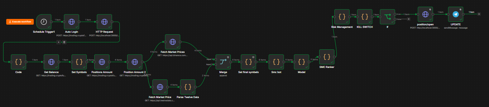

# SMC Crypto & Forex Trading Bot

Automated trading system that executes a **Smart Money Concepts (SMC)** strategy — market structure, Order Blocks, BOS/CHOCH, and liquidity zones — across crypto (BTC, ETH, SOL, AVAX) and forex (EURUSD).

## How it works

1. **n8n** orchestrates the entire pipeline on a 15-minute schedule.
2. **Binance API** pulls the last 100 candles (15m timeframe) per symbol; **Twelve Data API** pulls EURUSD data.
3. A **JavaScript** module (running inside n8n) analyzes the candles for SMC patterns: market structure shifts, Order Blocks, BOS/CHOCH, and liquidity sweeps.
4. Every signal is passed through an **XGBoost model** (trained in Python/Google Colab, deployed as **ONNX** inside the n8n flow) that scores the signal's confidence. Only signals scoring above the threshold move forward.
5. A **Node.js + Puppeteer** service logs into CryptoFundTrader and places the trade automatically.
6. A **Telegram bot** sends an alert for every trade opened.

## Why the confidence filter matters

Raw SMC signals have a high false-positive rate. Instead of predicting price, the XGBoost model predicts **signal quality** — using features like candle body %, volume ratio, risk/reward, and time of day — cutting down on low-probability trades before they're ever executed.

## Stack

`n8n` · `JavaScript / Node.js` · `Python` · `XGBoost` · `ONNX` · `Puppeteer` · `Binance API` · `Twelve Data API` · `Telegram Bot API`

## Notes

- Fully self-hosted; no third-party automation SaaS.
- API keys and credentials are stored as n8n environment credentials, not in this repo.
- Built and taught to myself independently as a personal project.
